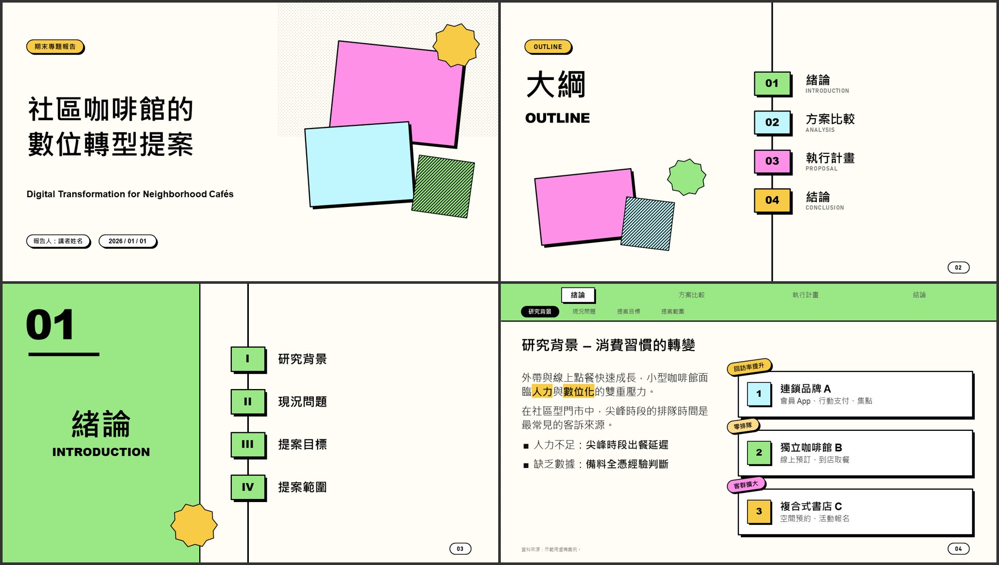
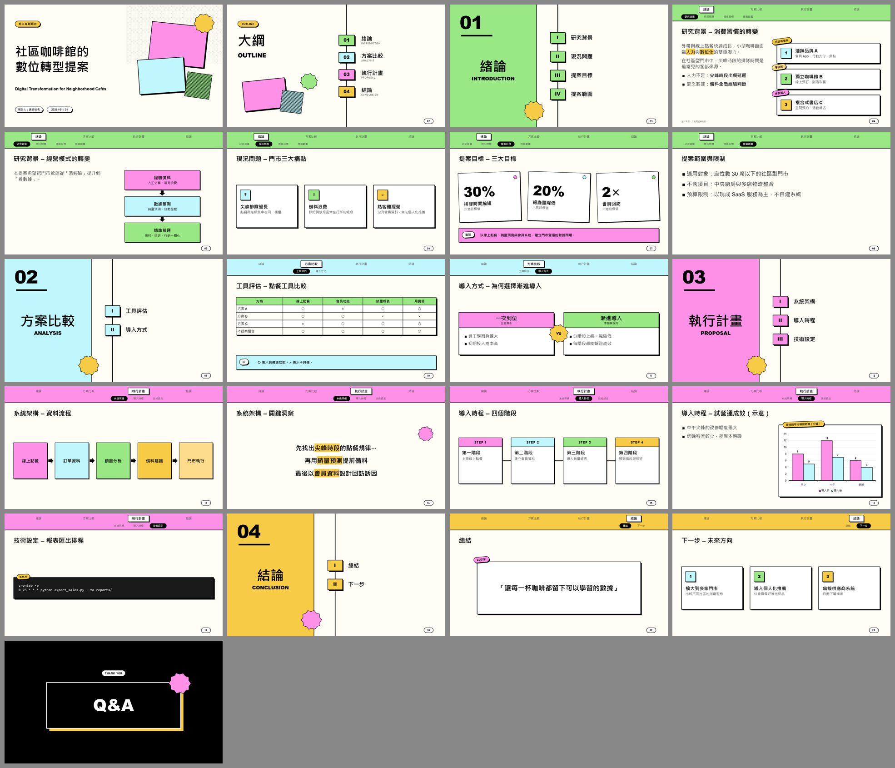
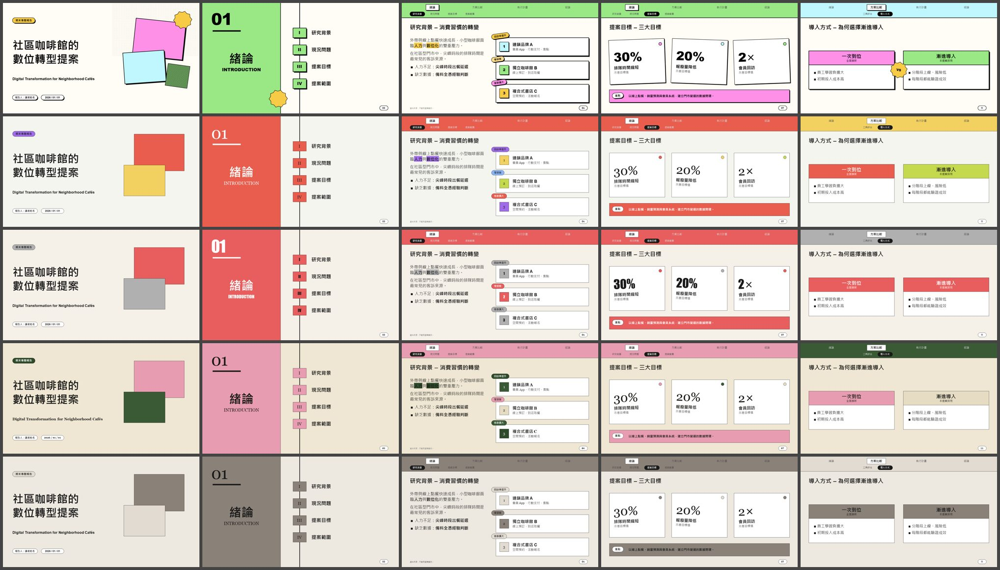

# deckframes

**Markdown 文稿 + 素材 → 可編輯的 PowerPoint（.pptx）。**
一套 CLI 加上一組 Agent Skills。Claude Code、Codex、Cursor 等 AI 程式助理都能照同一套流程幫你做簡報。

架構參考自 [HyperFrames](https://github.com/heygen-com/hyperframes)：用一個 CLI 做實際渲染，再用一組分工明確的 skills 教 AI 怎麼使用。差別在於 HyperFrames 做影片，deckframes 做簡報。HyperFrames 的設計（例如 BlockFrame 糖果色塊）可以一行指令轉成簡報主題。



<details>
<summary>完整範例（21 頁）與主題對照</summary>



由上到下：`blockframe`（內建），以及從 HyperFrames 匯入的 `capsule`、`coral`、`editorial-forest`、`cartesian`



</details>

> English summary at the [bottom](#english).

---

## 目錄

- [功能](#功能)
- [安裝](#安裝)
- [快速開始](#快速開始)
- [撰寫稿子](#撰寫稿子)
- [資訊圖表](#資訊圖表)
- [主題與模版](#主題與模版)
- [指令](#指令)
- [Skills 一覽](#skills-一覽)
- [常見問題](#常見問題)
- [開發](#開發)

---

## 功能

| 頁面 | 內容 |
|---|---|
| 封面 | 標題、英文副標、報告人、日期、裝飾色塊 |
| 大綱 | 所有章節串在一條直線上：編號色塊＋中英文章名 |
| 章節頁 | 左側章節色面板（大編號＋章名＋英文名），右側列出子章節（I、II、III…） |
| 內容頁 | 頂部導覽列：第一排是所有章節（目前章節凸顯），第二排是本章的子章節（目前位置反白） |
| 資訊圖表 | 卡片、流程、步驟、時間軸、大數字、左右對比、原生圖表、表格、提示框、宣言頁 |
| 結尾 | Q&A |

其他功能：
- 依實際文字框大小自動拆頁
- 中文斷行處理
- 講者備註、頁尾資料來源
- 文字顏色依底色自動調整
- `deck.json` 記錄進度，讓不同 AI 工具可以接手同一個專案

---

## 安裝

### 1. CLI

需要 Python 3.10 以上。三種方式擇一：

```bash
uv tool install git+https://github.com/ChienIKao/deckframes
pipx install git+https://github.com/ChienIKao/deckframes
pip install git+https://github.com/ChienIKao/deckframes
```

預覽功能需要 PowerPoint（Windows）或 LibreOffice；用 LibreOffice 時還要執行 `pip install pymupdf`。
安裝後執行 `deckframes doctor` 檢查環境。

### 2. Skills（讓 AI 工具會用）

**一行安裝到你電腦上的 AI 工具**（使用 [skills CLI](https://github.com/vercel-labs/skills)）：

```bash
npx skills add ChienIKao/deckframes
npx skills add ChienIKao/deckframes -a claude-code -a codex
```

第一行會逐一詢問要裝進哪些 AI 工具，第二行直接指定。

**手動安裝**：把 `skills/` 底下的資料夾複製到對應位置：

| 工具 | 個人層級 | 專案層級 |
|---|---|---|
| Claude Code | `~/.claude/skills/` | `.claude/skills/` |
| Codex | `~/.agents/skills/` | `.agents/skills/` |
| 其他支援 Agent Skills 的工具 | 見該工具的文件 | |

沒有 skill 機制的 AI 工具，會讀每個簡報專案裡由 `deckframes init` 自動產生的 `AGENTS.md`。

---

## 快速開始

### 交給 AI

在 Claude Code 或 Codex 裡說：

> 用 deckframes 把 `thesis.md` 做成口試簡報，素材在 `images/`

AI 會：
1. 問你用途、主題、要照稿直出還是幫你精煉
2. 建立專案資料夾
3. 整理 `deck.md`：修正階層、補英文章名、把適合的內容轉成資訊圖表
4. 建置、檢查、看預覽圖，修正後重建
5. 回報做了哪些調整

原稿存成 `source.md`，不會被修改。

### 自己用 CLI

```bash
deckframes init 20260708-defense --from thesis.md --workflow deckframes-academic-defense
cd 20260708-defense
# 編輯 deck.md
deckframes build          # → output/20260708-defense.pptx
deckframes check          # 溢出與超出邊界檢查，0 issue 才算通過
deckframes preview        # → output/…_preview/grid.png
deckframes status         # 目前進度與下一步
```

單一檔案也行：`deckframes build talk.md -o talk.pptx`

---

## 撰寫稿子

```markdown
---
eyebrow: 碩士論文口試報告
subtitle: English Subtitle
author: 報告人：講者姓名
date: 2026 / 07 / 08
---

# 簡報題目                          ← 封面
## 緒論 | Introduction              ← 章：大綱 + 章節頁（| 後是英文名）
### 研究背景                         ← 子章節：章節頁子目錄 + 導覽列第二排
#### 產業趨勢 | 副標                 ← 一張投影片，標題顯示為「研究背景 – 產業趨勢」

全球製造業正邁向==自動化==。        ← ==螢光筆強調==

- 條列一
- 條列二

> [!NOTE] 頁底提示框

資料來源：作者整理。                ← 頁尾出處

<!-- 講者備註 -->
```

完整規格：[`skills/deckframes-core/SKILL.md`](skills/deckframes-core/SKILL.md)

---

## 資訊圖表

在程式碼區塊標上元件名稱，裡面每一項用 ` | ` 分欄：

````markdown
```cards stack
- 連鎖品牌 A | 會員 App、行動支付 | tag: 回訪率提升 | img: assets/a.png
- 獨立咖啡館 B | 線上預訂、到店取餐 | tag: 零排隊
```
````

| 元件 | 適合 | 項目寫法 |
|---|---|---|
| `cards` | 並列案例、問題、亮點 | `- 標題 \| 說明 \| tag: 標籤 \| icon: ? \| img: 圖片` |
| `flow` | 演進、流程 | `- 節點 \| 說明`，或單行 `A -> B -> C` |
| `steps`／`timeline` | 方法步驟（直向／橫向） | `- 步驟 \| 說明` |
| `stats` | 關鍵數字 | `- 30% \| 標籤 \| 補充` |
| `compare` | 方案對比 | `- 方案 \| 副標`，縮排子項目為條列 |
| `chart` | 實驗數據 | 在 ```` ```chart column 標題 ```` 區塊內放 Markdown 表格 |

內容型態與元件的對照規則：[`skills/deckframes-infographics/SKILL.md`](skills/deckframes-infographics/SKILL.md)

---

## 主題與模版

```bash
deckframes themes list                    # 列出可用主題
deckframes themes import capsule          # 匯入 HyperFrames 設計（需已安裝 hyperframes skills）
deckframes themes import path/to/FRAME.md --name my-look
```

- **主題**（canvas 引擎）：程式直接繪製，有大綱、章節子目錄、導覽列和資訊圖表。
  匯入時會自動判斷背景、文字和強調色，把網頁字型換成 Office 內建字型，並決定要不要加裝飾。
- **.pptx 模版**：套用公司或學校的母片，但沒有導覽列和子目錄。見 [`skills/deckframes-templates`](skills/deckframes-templates/SKILL.md)。

主題欄位說明：[`skills/deckframes-design/SKILL.md`](skills/deckframes-design/SKILL.md)

---

## 指令

| 指令 | 說明 |
|---|---|
| `deckframes init DIR --from script.md [--theme T] [--workflow W] [--mode verbatim\|refine]` | 建立專案 |
| `deckframes build [deck.md] [-o out.pptx] [--theme T] [--template T]` | 建置 |
| `deckframes check [out.pptx] [--json]` | 檢查溢出與超出邊界（有問題時結束代碼為 1） |
| `deckframes preview [out.pptx]` | 每頁 PNG ＋ 總覽 grid.png |
| `deckframes status [--set STAGE] [--json]` | 進度：brief → draft → built → checked → reviewed |
| `deckframes themes list\|show\|import` | 主題管理 |
| `deckframes template inspect FILE.pptx [--write-config]` | 分析模版版面 |
| `deckframes doctor` | 環境檢查 |

---

## Skills 一覽

| Skill | 角色 |
|---|---|
| `deckframes` | 入口：檢查環境、接續專案、詢問需求、分派工作流 |
| `deckframes-academic-defense` | 工作流：論文口試、研究報告 |
| `deckframes-general` | 工作流：提案、授課、報告、募資簡報 |
| `deckframes-core` | deck.md 規格 |
| `deckframes-infographics` | 內容 → 資訊圖表 |
| `deckframes-design` | 主題、匯入 HyperFrames 設計 |
| `deckframes-cli` | 指令與 QA 迴圈 |
| `deckframes-templates` | .pptx 模版 |

---

## 常見問題

**跟 HyperFrames 的關係？**
架構參考 HyperFrames，並能匯入它的設計規格。本專案不是 HeyGen／HyperFrames 的官方專案。

**字型跟設計稿不一樣？**
網頁字型（Inter、Bodoni…）多半沒裝在簡報電腦上，所以會換成 Office 內建字型。中文一律用微軟正黑體。可以在主題 JSON 的 `fonts` 修改。

**`==強調==` 沒有色塊？** 需要 PowerPoint 2019 或 Microsoft 365。

**可以接著在 PowerPoint 裡改嗎？** 可以，所有元素都是原生的圖形、文字框、表格和圖表。但重新建置會覆蓋手動修改。

**AI 看不到圖片怎麼辦？** `deckframes check --json` 會輸出每頁的文字大綱和問題清單，AI 可以據此逐頁核對。

---

## 開發

```bash
git clone https://github.com/ChienIKao/deckframes && cd deckframes
pip install -e ".[preview]" pytest
pytest -q
```

程式架構與貢獻規則見 [`AGENTS.md`](AGENTS.md)。

---

## English

**deckframes** turns a Markdown script into an editable PowerPoint deck: cover, outline, chapter dividers with a section list, content slides with a chapter/section nav bar, and native infographics (cards, flow, steps, timeline, stats, compare, charts, tables, callouts). It ships as a Python CLI plus a set of [Agent Skills](https://agentskills.io) that any skills-capable coding agent (Claude Code, Codex, Cursor, …) can follow.

```bash
uv tool install git+https://github.com/ChienIKao/deckframes      # CLI
npx skills add ChienIKao/deckframes                              # skills for your agents
deckframes build talk.md -o talk.pptx && deckframes check talk.pptx
```

The architecture follows [HyperFrames](https://github.com/heygen-com/hyperframes): a CLI for rendering and focused skills for the agent. `deckframes themes import <preset>` converts any HyperFrames design preset (FRAME.md) into a slide theme. This project is not affiliated with HeyGen or HyperFrames.

## License

[MIT](LICENSE)
